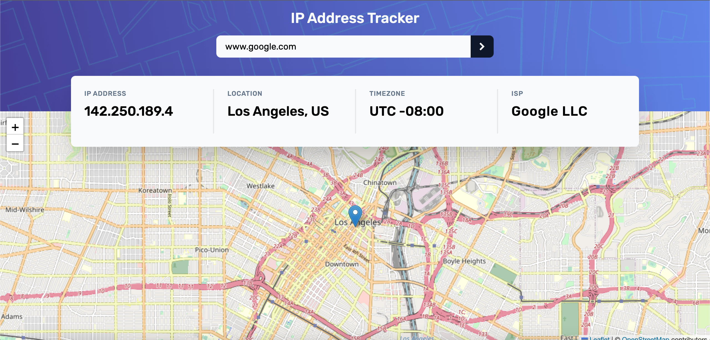
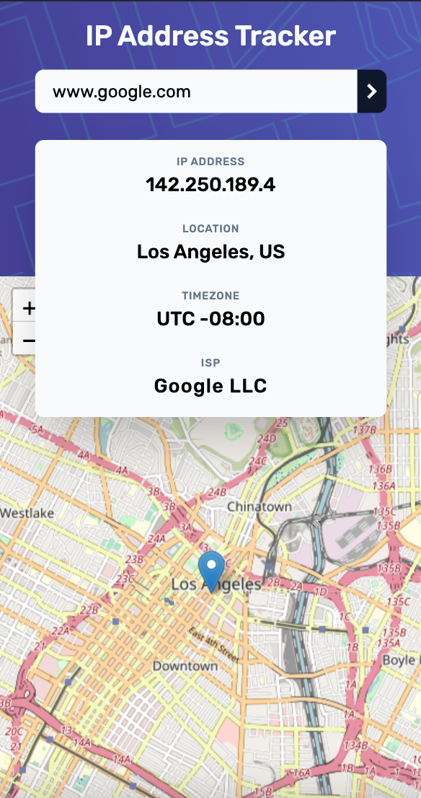

# Frontend Mentor - IP address tracker solution

This is a solution to the [IP address tracker challenge on Frontend Mentor](https://www.frontendmentor.io/challenges/ip-address-tracker-I8-0yYAH0). 
## Table of contents

- [The challenge](#the-challenge)
- [Screenshots](#screenshots)
- [Links](#links)
- [Built with](#built-with)
- [Author](#author)

## The challenge

Users should be able to:

- View the optimal layout for each page depending on their device's screen size
- See their own IP address on the map on the initial page load
- Search for any IP addresses or domains and see the key information and location

## Screenshots

Desktop:

Mobile:

### Links

- Solution URL: [https://github.com/trbogi/ip-address-tracker](https://github.com/trbogi/ip-address-tracker)
- Live Site URL: [https://trbogi.github.io/ip-address-tracker/](https://trbogi.github.io/ip-address-tracker/)

## Built with

- [React](https://reactjs.org/) - JS library
- [Tailwind CSS](https://tailwindcss.com/) - For styles

## Author

- GitHub - [trbogi](https://github.com/trbogi)
- LinkedIn - [Trencsényi Boglárka](https://www.linkedin.com/in/bogl%C3%A1rka-trencs%C3%A9nyi-16649720b/)
- E-mail - trencsenyi.bogi@gmail.com

